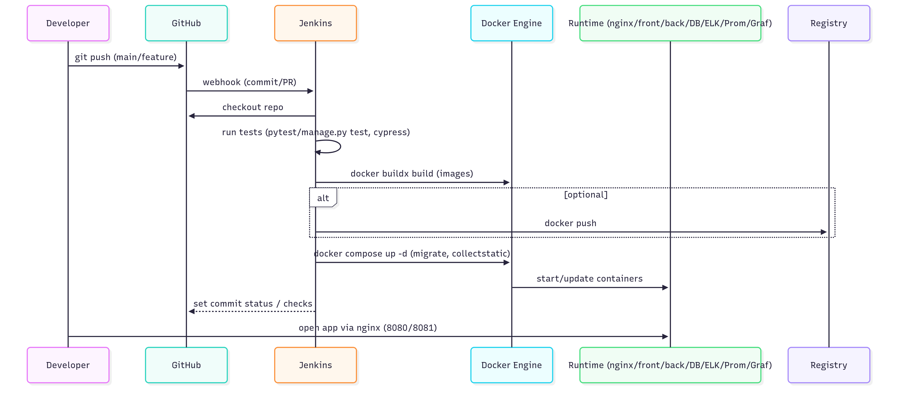

# ft\_transcendence

## 🎮 About the Project

**ft\_transcendence** is a fully featured gaming platform with two mini-games, built on a modern tech stack. The project showcases full-stack development skills, DevOps practices, and building scalable web applications.

### 🎯 Key Features

* **Pong** — the classic paddle game (single player and tournaments)
* **Clicker** — click-speed game with a tournament mode
* **Authentication system** with registration and login
* **Full monitoring** and logging
* **Scalable architecture** on Docker

### 🏗️ Architecture




```
Application architecture:

┌─────────────────┐    ┌─────────────────┐    ┌─────────────────┐
│   Frontend      │    │   Backend       │    │   Database      │
│   (HTML/JS/CSS) │◄──►│   (Django REST) │◄──►│   (PostgreSQL)  │
└─────────────────┘    └─────────────────┘    └─────────────────┘
         │                       │                       │
         └───────────────────────┼───────────────────────┘
                                 │
                    ┌─────────────────┐
                    │   Nginx Proxy   │
                    │   (SSL/HTTPS)   │
                    └─────────────────┘
                                 │
         ┌───────────────────────┼───────────────────────┐
         │                       │                       │
┌─────────────────┐    ┌─────────────────┐    ┌─────────────────┐
│   Monitoring    │    │   Logging       │    │   Alerting      │
│ (Prometheus/    │    │ (ELK Stack)     │    │ (Alertmanager)  │
│  Grafana)       │    │                 │    │                 │
└─────────────────┘    └─────────────────┘    └─────────────────┘
```

### 🛠️ Tech Stack

#### Backend

* **Django 3.2** — web framework
* **Django REST Framework** — API
* **PostgreSQL** — database
* **Custom Authentication** — integration with 42 School

#### Frontend

* **Vanilla JavaScript** — no frameworks
* **Bootstrap 5** — UI components
* **Three.js** — 3D graphics
* **Responsive Design** — mobile-friendly

#### DevOps & Infrastructure

* **Docker & Docker Compose** — containerization
* **Nginx** — reverse proxy and SSL
* **Prometheus** — metrics scraping
* **Grafana** — visualization
* **ELK Stack** — logging (Elasticsearch, Logstash, Kibana)
* **Alertmanager** — alerting

### 🎮 Game Mechanics

#### Pong

* Single-player vs AI
* Tournament mode
* Configurable max score (1, 3, 5)
* Rating and stats system

#### Clicker

* Tournament mode
* Click-speed measurement
* Configurable time limits (3, 5, 10 seconds)
* Player statistics

### 🔐 Security

* **SSL/TLS** encryption
* **CORS** configuration
* **CSRF** protection
* **Custom Authentication** with 42 School
* **Secure Headers** in Nginx
* **Environment Variables** for secrets
* **Secret Key** generation for production

### 📊 Monitoring & Observability

* **Real-time metrics** via Prometheus
* **Visualization** in Grafana
* **Centralized logging** via ELK
* **Alerts** via Alertmanager
* **Health checks** for all services

### 🚀 Interview-Ready Highlights

1. **End-to-end solution** — from games to monitoring
2. **Microservice-style architecture** — clear separation of concerns
3. **DevOps practices** — automation, monitoring, logging
4. **Security** — SSL, authentication, common protections
5. **Scalability** — Docker, isolated networks
6. **Modern stack** — up-to-date technologies

### 👥 Team

* **adavitav** — Backend
* **vgribkov** — Frontend
* **tgalyaut** — DevOps

---

## 🚀 Quick Start

### Prerequisites

* Docker and Docker Compose
* Make (on Unix systems)
* `.env` file with environment variables

### Run the project

```bash
# Clone the repository
git clone <repository-url>
cd ft_transcendence

# Create the .env file
cp env.example .env

# Generate a secure SECRET_KEY
python tools/generate_secret_key.py
# Copy the generated SECRET_KEY into your .env

# Edit .env with your settings
# Pay special attention to production passwords/secrets

# Build & start
make build
```

📖 **Detailed setup instructions**: [SETUP.md](SETUP.md)

### Service Access

* **Main app**: [https://localhost:8081](https://localhost:8081)
* **Grafana**: [http://localhost:3000](http://localhost:3000) or [https://localhost:8081/grafana](https://localhost:8081/grafana)
* **Prometheus**: [http://localhost:9090](http://localhost:9090)
* **Kibana**: [http://localhost:5601](http://localhost:5601) (under maintenance)
* **Alertmanager**: [http://localhost:9093](http://localhost:9093)

---

## 📋 Runbook

Usually it’s enough to run `make` to pull/build images and start containers. Then open the site at `localhost`. You’ll be redirected to `https://localhost:443`.

To access the web UI of each service, open `http://localhost:<port>`. Make sure UFW (or any firewall) allows the required ports:

* `port:3000` — Grafana
* `port:9090` — Prometheus
* `port:5601` — Kibana — under maintenance
* `port:9200` — Elasticsearch — under maintenance
* `port:5044` — Logstash — under maintenance
* `port:9113` — Nginx Exporter
* `port:9100` — Node Exporter
* `port:9093` — Alertmanager

## Configured redirects

If you want to open Grafana or Kibana through the proxy, use `localhost/grafana` or `localhost/kibana` to reach their web UIs.

## Grafana

Grafana may prompt for login. Credentials, if needed, are stored in `data/grafana/.grafanapw`.
A prebuilt dashboard tracks the host machine’s state. In the future we may add Nginx traffic stats (already scraped by Prometheus).

## Prometheus

Open Prometheus at `localhost:9090`. Under **Status → Targets**, you can see all metric sources connected in this project. Each **State** should be **UP** (green). If not — ping me on Telegram `@olnytim` :)

## Alertmanager

Configuration is in progress. I’m setting up an SMTP server for email notifications. More info will be added later. For now, you can access the web UI only.

## All configuration lives in `docker-compose.yaml`. More docs are coming; the compose file will evolve.

## Current total disk usage after bringing containers up is > n GB.

## TEAM `🔜SOON🔜`

* adavitav — Backend
* vgribkov — Frontend
* tgalyaut — DevOps

---

## 📚 API Documentation

### Authentication

```http
GET /oauth/login/
POST /oauth/logout/
GET /auth/user/
```

### Games

```http
# Pong
GET /api/pong/players/
GET /api/pong/games/
POST /api/pong/games/

# Clicker
GET /api/clicker/players/
GET /api/clicker/games/
POST /api/clicker/games/
```

### Example Requests

```bash
# Get current user profile
curl -H "Authorization: Bearer <token>" https://localhost:8081/auth/user/

# Create a new Pong game
curl -X POST https://localhost:8081/api/pong/games/ \
  -H "Content-Type: application/json" \
  -d '{"player1": 1, "player2": 2}'
```

---

## 🔧 Technical Details

### Project Structure

```
ft_transcendence/
├── back/                 # Django backend
│   ├── users/            # User model
│   ├── pong/             # Pong game
│   ├── clicker/          # Clicker game
│   └── back/             # Core Django settings
├── front/                # Frontend (Vanilla JS)
│   ├── pages/            # App pages
│   ├── game/             # Game logic
│   └── assets/           # Static files
├── nginx/                # Web server config
├── monitoring/           # Prometheus, Grafana, Alertmanager
├── elk/                  # Elasticsearch, Logstash, Kibana
└── postgresql/           # Database
```

### Environment Variables

```bash
# Django Settings
DJANGO_SECRET_KEY=your-secret-key-here
DJANGO_DEBUG=True

# Database Settings
POSTGRES_DB=test_db
POSTGRES_USER=admin
POSTGRES_PASSWORD=admin123
POSTGRES_HOST=postgres
POSTGRES_PORT=5432

# Elasticsearch Settings
ELASTIC_PASSWORD=your_elastic_password
ELASTIC_USER=elastic

# Grafana Settings
GF_USER=admin
GF_PASSWORD=your_grafana_password

# Kibana Settings
KIBANA_USER=kibana_system

# Optional: 42 School OAuth Settings (removed from project)
# INTRA_CLIENT_ID=your_intra_client_id
# INTRA_CLIENT_SECRET=your_intra_client_secret
# INTRA_REDIRECT_URI=https://localhost:8081/oauth/callback/
```

### Docker Compose Services

* **nginx** — reverse proxy (port 8081:443)
* **front** — frontend (port 5000:5000)
* **back** — backend API (port 5001:5001)
* **postgres** — database (port 5432:5432)
* **prometheus** — metrics (port 9090:9090)
* **grafana** — dashboards (port 3000:3000)
* **es01** — Elasticsearch (port 9200:9200)
* **kib01** — Kibana (port 5601:5601)
* **log01** — Logstash (port 5044:5044)
* **alertmanager** — alerts (port 9093:9093)

---

## 🚀 Roadmap

### Planned Improvements

* [ ] Redis for caching
* [ ] GitOps for config management
* [ ] CI/CD pipeline
* [ ] Kubernetes for orchestration
* [ ] Kafka for async processing
* [x] Unit & integration tests
* [ ] API documentation (Swagger)
* [ ] IaC with Terraform and Ansible
* [ ] Trivy for vulnerability scanning
