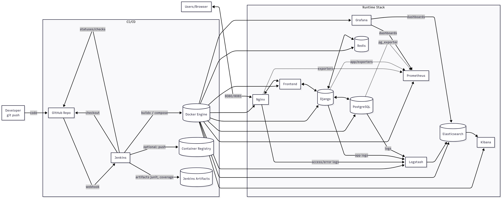
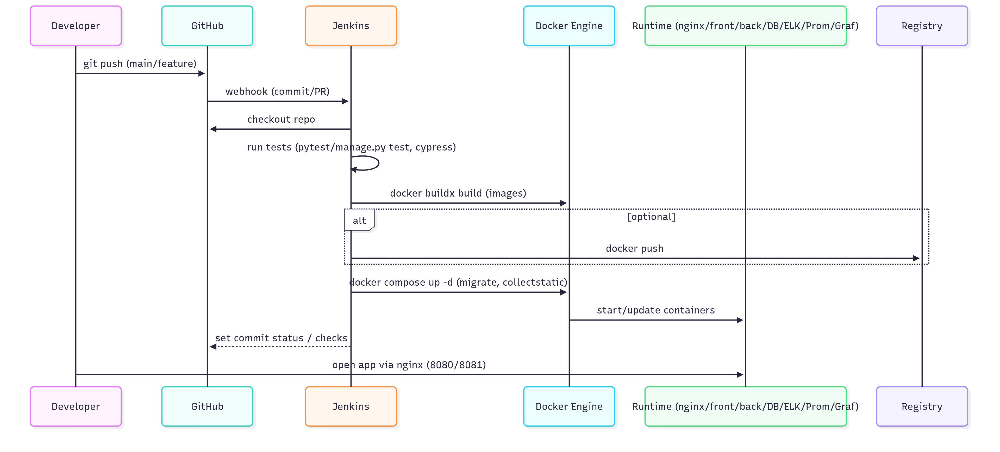

# ft_transcendence

## 🎮 О проекте

**ft_transcendence** - это полноценная игровая платформа с двумя мини-играми, построенная на современном стеке технологий. Проект демонстрирует навыки full-stack разработки, DevOps практик и создания масштабируемых веб-приложений.

### 🎯 Основные возможности
- **Pong** - классическая игра с ракетками (одиночная игра и турниры)
- **Clicker** - игра на скорость кликов с турнирным режимом
- **Система аутентификации** с регистрацией и входом
- **Полный мониторинг** и логирование
- **Масштабируемая архитектура** на Docker

### 🏗️ Архитектура




```
Архитектура приложения:

┌─────────────────┐    ┌─────────────────┐    ┌─────────────────┐
│   Frontend      │    │   Backend       │    │   Database      │
│   (HTML/JS/CSS) │◄──►│   (Django REST) │◄──►│   (PostgreSQL)  │
└─────────────────┘    └─────────────────┘    └─────────────────┘
         │                       │                       │
         └───────────────────────┼───────────────────────┘
                                 │
                    ┌─────────────────┐
                    │   Nginx Proxy   │
                    │   (SSL/HTTPS)   │
                    └─────────────────┘
                                 │
         ┌───────────────────────┼───────────────────────┐
         │                       │                       │
┌─────────────────┐    ┌─────────────────┐    ┌─────────────────┐
│   Monitoring    │    │   Logging       │    │   Alerting      │
│ (Prometheus/    │    │ (ELK Stack)     │    │ (Alertmanager)  │
│  Grafana)       │    │                 │    │                 │
└─────────────────┘    └─────────────────┘    └─────────────────┘
```

### 🛠️ Технологический стек

#### Backend
- **Django 3.2** - веб-фреймворк
- **Django REST Framework** - API
- **PostgreSQL** - база данных
- **Custom Authentication** - интеграция с 42 School

#### Frontend
- **Vanilla JavaScript** - без фреймворков
- **Bootstrap 5** - UI компоненты
- **Three.js** - 3D графика
- **Responsive Design** - адаптивность

#### DevOps & Infrastructure
- **Docker & Docker Compose** - контейнеризация
- **Nginx** - обратный прокси и SSL
- **Prometheus** - сбор метрик
- **Grafana** - визуализация
- **ELK Stack** - логирование (Elasticsearch, Logstash, Kibana)
- **Alertmanager** - система алертов

### 🎮 Игровые механики

#### Pong
- Одиночная игра против AI
- Турнирный режим
- Настраиваемый максимальный счет (1, 3, 5)
- Система рейтинга и статистики

#### Clicker
- Турнирный режим
- Измерение скорости кликов
- Настраиваемое время (3, 5, 10 секунд)
- Статистика игроков

### 🔐 Безопасность
- **SSL/TLS** шифрование
- **CORS** настройки
- **CSRF** защита
- **Custom Authentication** с 42 School
- **Secure Headers** в Nginx
- **Environment Variables** для конфиденциальных данных
- **Secret Key** генерация для production

### 📊 Мониторинг и Observability
- **Real-time метрики** через Prometheus
- **Визуализация** в Grafana
- **Централизованное логирование** через ELK
- **Алерты** через Alertmanager
- **Health checks** для всех сервисов

### 🚀 Ключевые особенности для собеседований

1. **Полноценное решение** - от игр до мониторинга
2. **Микросервисная архитектура** - разделение ответственности
3. **DevOps практики** - автоматизация, мониторинг, логирование
4. **Безопасность** - SSL, аутентификация, защита от атак
5. **Масштабируемость** - Docker, отдельные сети
6. **Современный стек** - актуальные технологии

### 👥 Команда
- **adavitav** - Backend разработка
- **vgribkov** - Frontend разработка  
- **tgalyaut** - DevOps

---

## 🚀 Быстрый старт

### Предварительные требования
- Docker и Docker Compose
- Make (для Unix-систем)
- Файл `.env` с переменными окружения

### Запуск проекта
```bash
# Клонирование репозитория
git clone <repository-url>
cd ft_transcendence

# Создание .env файла
cp env.example .env

# Генерация безопасного SECRET_KEY
python tools/generate_secret_key.py
# Скопируйте сгенерированный SECRET_KEY в .env файл

# Отредактируйте .env файл с вашими настройками
# Особое внимание уделите паролям для production

# Запуск проекта
make build
```

📖 **Подробные инструкции по настройке**: [SETUP.md](SETUP.md)

### Доступ к сервисам
- **Основное приложение**: https://localhost:8081
- **Grafana**: http://localhost:3000 или https://localhost:8081/grafana
- **Prometheus**: http://localhost:9090
- **Kibana**: http://localhost:5601 (на обслуживании)
- **Alertmanager**: http://localhost:9093

---

## 📋 Инструкция по запуску
Сейчас хватает написать make, чтобы образы контейнеров спуллились|сбилдились, и контейнеры запустятся. После этого можно заходить на сайт, вводя ```localhost``` в браузере. В данном случае происходит редирект на ```https://localhost:443```

Чтобы попасть на веб-морду сервисов, нужно ввести ```http://localhost:<port>```. Номера портов сервисов, доступных для просмотра(убедитесь, что есть необходимые настройки UFW(любых других Firewall'ов):
+ ```port:3000``` - Grafana
+ ```port:9090``` - Prometheus
+ ```port:5601``` - ElasticSearch - on maintenance
+ ```port:9200``` - Kibana - on maintenance
+ ```port:5044``` - Logstash - on maintenance
+ ```port:9113``` - Nginx-exporter
+ ```port:9100``` - Node-exporter
+ ```port:9093``` - Alertmanager

## Настроил редиректы
Теперь, если вы хотите зайти в Grafana или Kibana, то можно прописать ```localhost/grafana``` или ```localhost/kibana```, и попадете на веб-морды соответствующих сервисов.

## Grafana
Grafana может предложить авторизоваться. Данные для входа, при необходимости, хранятся в ```data/grafana/.grafanapw```.
В Grafana уже есть настроенный дашборд, который отслеживает состояние host-машины. В будущем можно добавить данные о трафике, проходящем через nginx (данные собираются и хранятся в prometheus)

## Prometheus
Попасть на prometheus можно через ```localhost:9090```. Во вкладке Status->Targets можете увидить все источники метрик, которые подключены в этом проекте. ```State``` у каждого источника должен быть ```UP``` и гореть зеленым. Если нет - пишите в тг @olnytim :)

## Alertmanager
Пока только в работе настройка этого сервиса. Нахожусь на стадии создания smtp сервера, через который будет происходить рассылка email. Позже добавлю инфу. Пока есть возможность только зайти на веб-морду этого сервиса.

## Вся инфа прописана в docker-compose.yaml файле. Позже добавлю доку и docker-compose будет ещё меняться.
## Текущий общий объём используемого дискового пространства после поднятия контейнеров > nGB.

## TEAM ```🔜SOON🔜```
+ adavitav - Backend
+ vgribkov - Frontend
+ tgalyaut - DevOps

---

## 📚 API Документация

### Аутентификация
```http
GET /oauth/login/
POST /oauth/logout/
GET /auth/user/
```

### Игры
```http
# Pong
GET /api/pong/players/
GET /api/pong/games/
POST /api/pong/games/

# Clicker
GET /api/clicker/players/
GET /api/clicker/games/
POST /api/clicker/games/
```

### Примеры запросов
```bash
# Получение профиля пользователя
curl -H "Authorization: Bearer <token>" https://localhost:8081/auth/user/

# Создание новой игры в Pong
curl -X POST https://localhost:8081/api/pong/games/ \
  -H "Content-Type: application/json" \
  -d '{"player1": 1, "player2": 2}'
```

---

## 🔧 Технические детали

### Структура проекта
```
ft_transcendence/
├── back/                 # Django backend
│   ├── users/           # Модель пользователей
│   ├── pong/           # Игра Pong
│   ├── clicker/        # Игра Clicker
│   └── back/           # Основные настройки Django
├── front/              # Frontend (Vanilla JS)
│   ├── pages/          # Страницы приложения
│   ├── game/           # Игровая логика
│   └── assets/         # Статические файлы
├── nginx/              # Конфигурация веб-сервера
├── monitoring/         # Prometheus, Grafana, Alertmanager
├── elk/               # Elasticsearch, Logstash, Kibana
└── postgresql/        # База данных
```

### Переменные окружения
```bash
# Django Settings
DJANGO_SECRET_KEY=your-secret-key-here
DJANGO_DEBUG=True

# Database Settings
POSTGRES_DB=test_db
POSTGRES_USER=admin
POSTGRES_PASSWORD=admin123
POSTGRES_HOST=postgres
POSTGRES_PORT=5432

# Elasticsearch Settings
ELASTIC_PASSWORD=your_elastic_password
ELASTIC_USER=elastic

# Grafana Settings
GF_USER=admin
GF_PASSWORD=your_grafana_password

# Kibana Settings
KIBANA_USER=kibana_system

# Optional: 42 School OAuth Settings (removed from project)
# INTRA_CLIENT_ID=your_intra_client_id
# INTRA_CLIENT_SECRET=your_intra_client_secret
# INTRA_REDIRECT_URI=https://localhost:8081/oauth/callback/
```

### Docker Compose сервисы
- **nginx** - обратный прокси (порт 8081:443)
- **front** - frontend (порт 5000:5000)
- **back** - backend API (порт 5001:5001)
- **postgres** - база данных (порт 5432:5432)
- **prometheus** - метрики (порт 9090:9090)
- **grafana** - дашборды (порт 3000:3000)
- **es01** - Elasticsearch (порт 9200:9200)
- **kib01** - Kibana (порт 5601:5601)
- **log01** - Logstash (порт 5044:5044)
- **alertmanager** - алерты (порт 9093:9093)

---

## 🚀 Развитие проекта

### Планируемые улучшения
- [ ] Redis для кэширования
- [ ] GitOps для управления конфигурацией
- [ ] CI/CD pipeline
- [ ] Kubernetes для оркестрации
- [ ] Kafka для асинхронной обработки
- [x] Unit и integration тесты
- [ ] API документация (Swagger)
- [ ] IaC с Terraform и Ansible
- [ ] Trivy для сканирования уязвимостей
